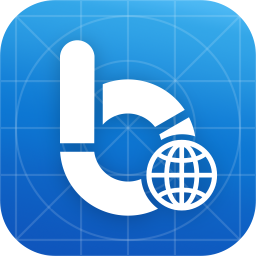

<h1> Budget Flow - Translations
  
</h1>
<p>
  Translations for "Budget Flow", a modern and easy to use expense tracking app for iPhone, iPad, Mac and Apple Watch.
</p>

[](https://github.com/fhasse95/budget-flow-ios-translations/pulls)
[](https://developer.apple.com/xcode)

## Introduction
Budget Flow currently supports over 30 languages. However, since many of these translations were generated automatically, some may contain inaccuracies or sound unnatural (see status table below).

Thanks to the incredible support of many kind users, several people have already contributed to improving the translations of the app, and I am truly grateful for their help. You can find a list of all users who have assisted with the translation in the "Acknowledgments" section of the app.

If your language is not yet supported or if you notice an issue with the translation, I’d love to hear from you! You can either send me an email at mail@budget-flow.app or contact me directly within the app under "Help with Translation" in settings. Additionally, all current translation files are available in this open-source repository, and contributions are always welcome! 😊

### Translation Status
| Language | ISO-Code | Countries | Translator | Status |
|:--|:--|:--|:--|:--|
| Arabic | ar | 🇸🇦 🇪🇬 🇦🇪 🇲🇦 🇶🇦 + | Mohamed Alyahri | 🟢 Proofread |
| Bosnian | bs | 🇧🇦 | Antonio Dujmović | 🟢 Proofread |
| Catalan | ca | 🇦🇩 | Jesús López Gómez | 🟢 Proofread |
| Chinese (Simplified) | zh-Hans | 🇨🇳 🇸🇬 | Boran Cui | 🟢 Proofread |
| Chinese (Traditional) | zh-Hant | 🇹🇼 🇭🇰 🇲🇴 | - | 🟡 Auto Translated |
| Croatian | hr | 🇭🇷 | Antonio Dujmović | 🟢 Proofread |
| Czech | cs | 🇨🇿 | - | 🟡 Auto Translated |
| Danish | da | 🇩🇰 | - | 🟡 Auto Translated |
| Dutch | nl | 🇳🇱 🇧🇪 | - | 🟡 Auto Translated |
| English | en | 🇺🇸 🇬🇧 🇨🇦 🇮🇪 🇦🇺 + | Fabian Hasse | 🟢 Proofread |
| Finnish | fi | 🇫🇮 | - | 🟡 Auto Translated |
| French | fr | 🇫🇷 🇨🇦 🇧🇪 🇨🇭 🇱🇺 + | Aram | 🟢 Proofread |
| German | de | 🇩🇪 🇦🇹 🇨🇭 | Fabian Hasse | 🟢 Proofread |
| Greek | el | 🇬🇷 🇨🇾 | - | 🟡 Auto Translated |
| Hungarian | hu | 🇭🇺 | - | 🟡 Auto Translated |
| Indonesian | id | 🇮🇩 | Alex Wijaya | 🟢 Proofread |
| Italian | it | 🇮🇹 🇸🇲 🇻🇦 🇨🇭 | Fabio Zaramella | 🟢 Proofread |
| Japanese | ja | 🇯🇵 | - | 🟢 Proofread |
| Korean | ko | 🇰🇷 | Junghwan Lee | 🟢 Proofread |
| Norwegian Bokmål | nb | 🇳🇴 | - | 🟡 Auto Translated |
| Polish | pl | 🇵🇱 | Jakub Domeracki | 🟢 Proofread |
| Portuguese (Portugal) | pt-PT | 🇵🇹 🇨🇻 🇲🇿 🇦🇴 🇬🇼 + | Sergio Lourenco | 🟢 Proofread |
| Portuguese (Brazil) | pt-BR | 🇧🇷 | José Henrique Leão | 🟢 Proofread |
| Romanian | ro | 🇷🇴 | - | 🟡 Auto Translated |
| Russian | ru | 🇷🇺 🇧🇾 🇰🇿 🇰🇬 | Ilya Yuhatskiy | 🟢 Proofread |
| Slovenian | sl | 🇸🇮 | David Rok Roglič | 🟢 Proofread |
| Slovak | sk | 🇸🇰 | - | 🟡 Auto Translated |
| Spanish | es | 🇪🇸 🇲🇽 🇦🇷 🇨🇴 🇵🇪 + | Javier Parra | 🟢 Proofread |
| Swedish | sv | 🇸🇪 | - | 🟡 Auto Translated |
| Thai | th | 🇹🇭 | - | 🟡 Auto Translated |
| Turkish | tr | 🇹🇷 | - | 🟡 Auto Translated |
| Ukrainian | uk | 🇺🇦 | Marian Leontiev | 🟢 Proofread |
| Vietnamese | vi | 🇻🇳 | Vũ Tuấn | 🟢 Proofread |

<br>

## Contribute
The following steps are necessary to participate in the translation process:

### 1) Fork this repository
Click the "Fork" button in the top right corner of this repository to create your own copy of it.

### 2) Clone your forked repository
```console
# Clone your forked repository
git clone https://github.com/<your-username>/budget-flow-ios-translations.git

# Navigate into the project directory
cd budget-flow-ios-translations

# Create a new branch for your changes
git checkout -b <your-branch-name>
```

> [!NOTE]
> Make sure [Git](https://git-scm.com/downloads) is installed on your system before running these commands.

### 3) Adjust the translations
To translate the entries, simply change the **values** of each key (e.g. `"account_type_payment" = "<VALUE>";`).

**Do not translate:**
- The `"app_name"` since "Budget Flow" remains the same in every locale.
- Specific terms like `"Face ID"` / `"Touch ID"` – these should stay unchanged.
- Entries under `/* Contact Developer */` – those should remain in English so I can understand support requests.


### 4) Commit and push your changes
```console
# Commit and push your changes
git commit -m "Updated translations"
git push origin <your-branch-name>
```

### 5) Open a Pull Request
- Go to the repository on GitHub.
- You’ll see a prompt to open a Pull Request (PR) from your recently pushed branch.
- Give your PR a descriptive title and a short summary of what you changed.
- Submit the PR against the main branch.

When you're done with the translation, just let me know so I can add the changes in the next update. I can also mention you under the acknowledgements if you want (either with your full name or just the first name).

Thanks for participating! 😊
